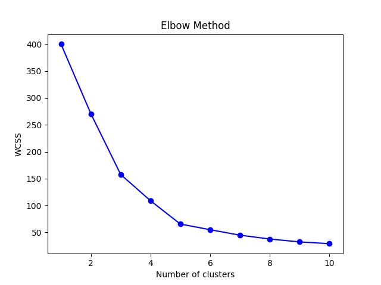

# 🛍️ Customer Segmentation using K-Means Clustering

This project implements a **K-Means clustering** algorithm to segment customers of a retail store based on their annual income and spending score. This helps identify customer groups for targeted marketing and personalized offers.

---

## 📊 Features Used

- `Annual Income (k$)`: Customer's yearly income
- `Spending Score (1-100)`: Score assigned by the store based on customer behavior

---

## 🧠 Clustering Summary

- **Algorithm**: K-Means Clustering
- **Library**: Scikit-learn
- **Feature Scaling**: StandardScaler
- **Evaluation**:
  - Elbow Method for choosing optimal `k`
  - Silhouette Score for clustering quality
- **Visualization**: 2D scatter plot with color-coded clusters

---

## 📁 Project Structure

```bash
customer_segmentation/
├── Mall_Customers.csv
├── customer_segmentation.py
├── README.md
```

---

## 🚀 How to Run

### 1. Clone the Repository

```bash
git clone https://github.com/YOUR_USERNAME/customer-segmentation.git
cd customer-segmentation
```

### 2. Install Dependencies

```bash
pip install pandas numpy matplotlib seaborn scikit-learn
```

### 3. Run the Python Script

```bash
python customer_segmentation.py
```

---

## 🖼 Output Sample

The output is a scatter plot showing customer segments:



*Make sure `output.png` is saved in the project directory and committed to GitHub.*

---

## 📦 Requirements

- Python 3.7+
- pandas
- numpy
- matplotlib
- seaborn
- scikit-learn

---

## 👨‍💻 Author

**Dheeraj Konakalla**  
📧 dheerajkonakalla0412@gmail.com  
🔗 [GitHub](https://github.com/Dheerajkonakalla4) • [LinkedIn](https://linkedin.com/in/dheeraj-konakalla)

---

## 📜 License

This project is open-sourced under the MIT License.
